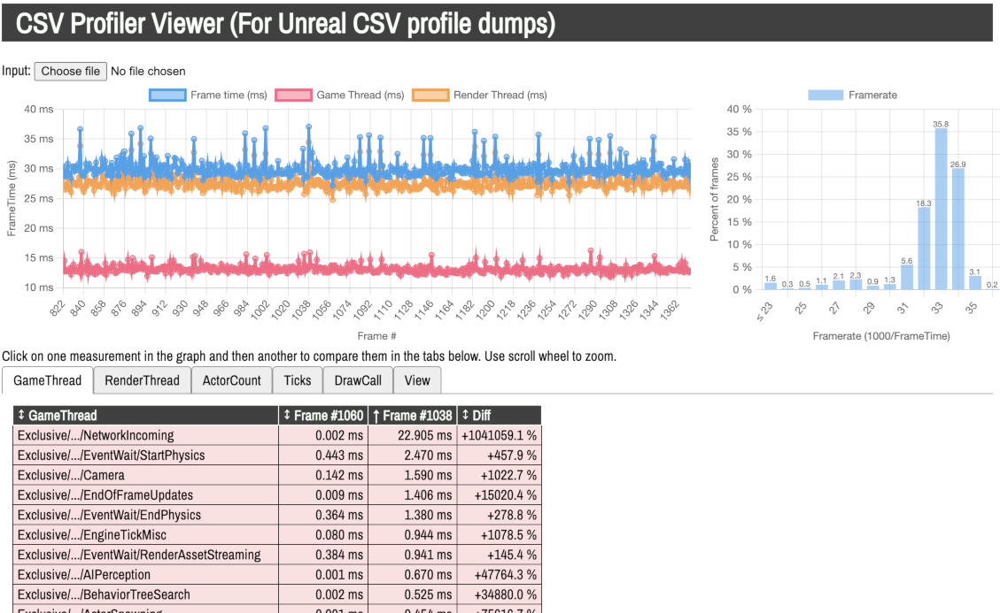

Runalyzer
===

This is a Single Page Application written in typescript to analyze output from Epic Unreal engine CSV files.

Using
--

Load the page and upload a file to it. It will display the first 1000 frames in the file (due to chart.js becoming sluggish otherwise).

Click on A measurement circle to add it as the rightmost frame in the analysis tables below. Clicking another frame moves the right column to the left one and adds the data to the right column.

Recommended best practice...

 - First click a good frame with low frametime
 - Then click a bad frame with high frametime.
 - Click the various tabs to compare different data. Click column headers to sort.
 - Sort descending on the rightmost frame column. This way you will see expensive things at the top, and compare them with their counterpart in the leftmost column.

This can serve as a good pointer to where to start to look for things that are expensive!

Enjoy!

Building
===

 - Clone the repository: `git clone git@github.com:vegolasse/CSVProfilerViewer.git`
 - cd into that directory: `cd CSVProfilerViewer`
 - Run `npm install`
 - Run `npm run start`
 - Smurf to [http://localhost:4000/](http://localhost:4000/)
